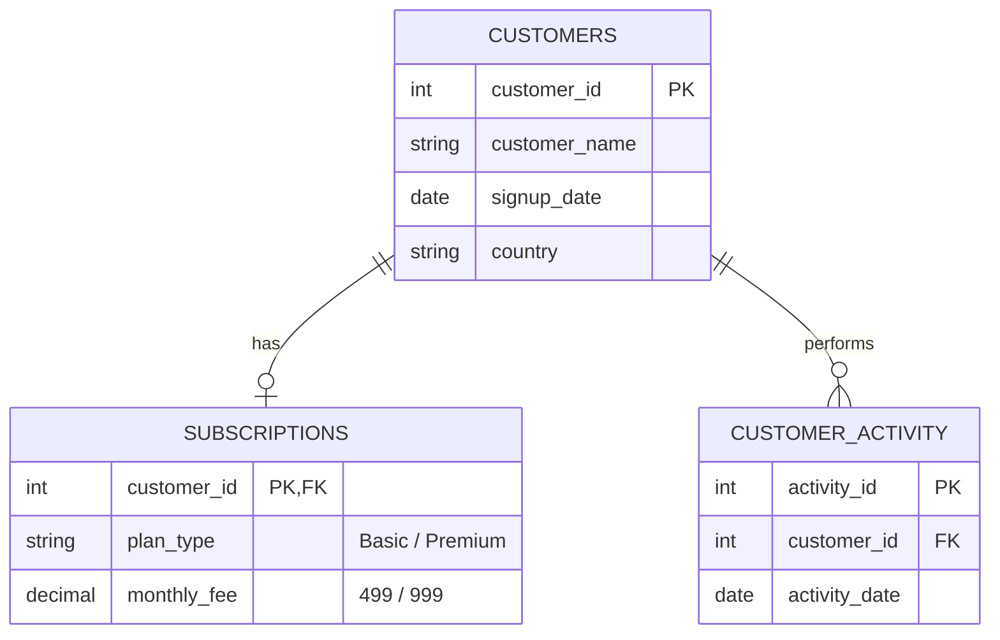

# Customer Churn & Retention Analysis Dashboard

[](https://en.wikipedia.org/wiki/SQL)
[](https://powerbi.microsoft.com/)
[]()

**Author:** R Holika  
**Registration Number:** 22MID0307  
**Domain:** Business Intelligence, Customer Analytics & Retention Strategy  

---

## 📌 Executive Summary & Objective

Customer churn is one of the most critical metrics for subscription-based digital services (such as SaaS, streaming, and membership platforms). Retaining existing customers is significantly more cost-effective than acquiring new ones. 

This project delivers an end-to-end analytical pipeline using **SQL** and **Power BI** to:
1. Model relational customer activity and subscription datasets.
2. Formulate and implement a **30-day inactivity threshold** to classify customers as **Active** or **Churned**.
3. Aggregate executive-level KPIs: **Total Customers**, **Active Customers**, **Churned Customers**, and **Overall Churn %**.
4. Analyze churn drivers across subscription tiers (**Basic** vs. **Premium**) and geographic regions (**India**, **UK**, **USA**).
5. Build an interactive **Power BI Executive Dashboard** with dynamic slicers, trend lines, and KPI cards to empower stakeholders to deploy targeted retention campaigns.

---

## 🛠️ Technologies Used

| Technology | Purpose |
| :--- | :--- |
| **SQL (MySQL / SQLite / ANSI SQL)** | Relational data modeling, multi-table joins, date math, churn classification logic, and KPI aggregation. |
| **Power BI Desktop** | Interactive data dashboard, visual layout, dynamic filtering, and KPI card presentation. |
| **DAX (Data Analysis Expressions)** | Aggregation measures (`total customers`, `active customers`, `churned customers`, `churn %`). |
| **Python (pandas, sqlite3)** | Automated testing, data validation, boundary-case verification, and pipeline regression testing. |

---

## 📊 Dataset Architecture & Schema

The data model uses a clean, normalized relational design consisting of three primary tables:



### Relational Table Descriptions
1. **`customers`** (30 records): Master demographic data including unique `customer_id`, `customer_name`, `signup_date` (spanning Jan 2024 to Nov 2024), and `country` (India, USA, UK).
2. **`subscriptions`** (30 records): Subscription tier details linking 1:1 with `customer_id`. Covers two tiers:
   - **Basic:** ₹499/month (15 customers)
   - **Premium:** ₹999/month (15 customers)
3. **`customer_activity`** (30 records): Granular event log recording user interactions and logins across late 2025.
   - *Key Testing Characteristic:* Customers `29` and `30` have zero recorded activities post-signup, deliberately included to test `LEFT JOIN` boundary conditions and null handling.

---

## 🔍 Churn Definition & Methodology

### Core Business Rule
A customer is classified based on their recency of engagement relative to an analytical cutoff date (**`2025-12-20`**):

$$\text{Inactivity Days} = \text{Reference Date (2025-12-20)} - \max(\text{activity\_date})$$

- **Churned:** If a customer has **no recorded activity** (`NULL`) OR if their last activity occurred **more than 30 days prior** ($\text{Inactivity Days} > 30$).
- **Active:** If a customer engaged within the trailing 30-day window ($\text{Inactivity Days} \le 30$).

### Boundary Cases Evaluated
| Scenario | Example Customer | Last Activity Date | Days Inactive | Classification | Explanation |
| :--- | :--- | :--- | :--- | :--- | :--- |
| **Recent Activity** | Customer 13 (Deepak) | `2025-12-19` | 1 day | **Active** | Highly engaged customer ($1 \le 30$). |
| **Within 30 Days** | Customer 16 (Sneha) | `2025-11-30` | 20 days | **Active** | Recent activity within the active threshold ($20 \le 30$). |
| **Exactly 30 Days** | Theoretical Boundary | `2025-11-20` | 30 days | **Active** | Retention threshold boundary ($\le 30$ days is Active). |
| **Past 30 Days** | Customer 23 (Suresh) | `2025-11-01` | 49 days | **Churned** | Inactivity threshold exceeded ($49 > 30$). |
| **Long-Term Inactivity**| Customer 21 (Rohit) | `2025-07-20` | 153 days | **Churned** | Extended lapse in engagement ($153 > 30$). |
| **Zero Activity** | Customer 29 & 30 | `NULL` | N/A | **Churned** | Signed up but never active; captured via `LEFT JOIN`. |

---

## 💻 SQL Implementation

### 1. Master Classification Query
```sql
SELECT 
    c.customer_id,
    c.customer_name,
    c.country,
    s.plan_type,
    s.monthly_fee,
    MAX(a.activity_date) AS last_activity_date,
    DATEDIFF('2025-12-20', MAX(a.activity_date)) AS days_inactive,
    CASE
        WHEN MAX(a.activity_date) IS NULL THEN 'Churned'
        WHEN DATEDIFF('2025-12-20', MAX(a.activity_date)) > 30 THEN 'Churned'
        ELSE 'Active'
    END AS customer_status
FROM customers c
LEFT JOIN subscriptions s
    ON c.customer_id = s.customer_id
LEFT JOIN customer_activity a
    ON c.customer_id = a.customer_id
GROUP BY 
    c.customer_id,
    c.customer_name,
    c.country,
    s.plan_type,
    s.monthly_fee
ORDER BY c.customer_id;
```

### 2. Headline KPI Aggregation Query
```sql
SELECT 
    COUNT(*) AS total_customers,
    SUM(CASE WHEN customer_status = 'Active' THEN 1 ELSE 0 END) AS active_customers,
    SUM(CASE WHEN customer_status = 'Churned' THEN 1 ELSE 0 END) AS churned_customers,
    ROUND(
        SUM(CASE WHEN customer_status = 'Churned' THEN 1 ELSE 0 END) * 100.0 / COUNT(*), 
        2
    ) AS churn_percentage
FROM (
    SELECT 
        c.customer_id,
        CASE
            WHEN MAX(a.activity_date) IS NULL THEN 'Churned'
            WHEN DATEDIFF('2025-12-20', MAX(a.activity_date)) > 30 THEN 'Churned'
            ELSE 'Active'
        END AS customer_status
    FROM customers c
    LEFT JOIN customer_activity a
        ON c.customer_id = a.customer_id
    GROUP BY c.customer_id
) classified_customers;
```

### 3. Plan-Level Breakdown Query
```sql
SELECT 
    s.plan_type,
    COUNT(*) AS total_customers,
    SUM(CASE WHEN cs.customer_status = 'Active' THEN 1 ELSE 0 END) AS active_customers,
    SUM(CASE WHEN cs.customer_status = 'Churned' THEN 1 ELSE 0 END) AS churned_customers,
    ROUND(
        SUM(CASE WHEN cs.customer_status = 'Churned' THEN 1 ELSE 0 END) * 100.0 / COUNT(*),
        2
    ) AS churn_percentage
FROM (
    SELECT 
        c.customer_id,
        CASE
            WHEN MAX(a.activity_date) IS NULL THEN 'Churned'
            WHEN DATEDIFF('2025-12-20', MAX(a.activity_date)) > 30 THEN 'Churned'
            ELSE 'Active'
        END AS customer_status
    FROM customers c
    LEFT JOIN customer_activity a
        ON c.customer_id = a.customer_id
    GROUP BY c.customer_id
) cs
JOIN subscriptions s
    ON cs.customer_id = s.customer_id
GROUP BY s.plan_type
ORDER BY churn_percentage DESC;
```

---

## 📈 Verified Key Performance Indicators (KPIs)

All metrics have been independently calculated and cross-verified against SQL outputs, automated tests, and Power BI visual containers:

| KPI Metric | Value | Verification Status | Calculation Formula |
| :--- | :--- | :--- | :--- |
| **Total Customers** | **30** | Verified (Exact) | `COUNT(customer_id)` |
| **Active Customers** | **14** | Verified (Exact) | `COUNTIF(customer_status = 'Active')` |
| **Churned Customers** | **16** | Verified (Exact) | `COUNTIF(customer_status = 'Churned')` |
| **Overall Churn Rate** | **53.33%** | Verified (Exact) | `(16 / 30) * 100 = 53.33%` |

### Subscription Plan Performance
| Plan Tier | Total Customers | Active | Churned | Churn Rate % | Status |
| :--- | :---: | :---: | :---: | :---: | :--- |
| **Basic (₹499)** | 15 | 4 | **11** | **73.33%** | High Churn Risk |
| **Premium (₹999)**| 15 | 10 | **5** | **33.33%** | High Retention |

### Geographic Breakdown
| Country | Total Customers | Active | Churned | Churn Rate % |
| :--- | :---: | :---: | :---: | :---: |
| **UK** | 6 | 1 | 5 | **83.33%** |
| **USA** | 6 | 3 | 3 | **50.00%** |
| **India** | 18 | 10 | 8 | **44.44%** |

---

## 🖥️ Power BI Executive Dashboard

The interactive Power BI file (`power_bi/customer_churn_analysis_dashboard.pbix`) is constructed with **12 visual containers**:

```
+-------------------------------------------------------------------------------+
|                        CUSTOMER CHURN ANALYSIS                                |
+---------------------+--------------------+-------------------+----------------+
|  TOTAL CUSTOMERS    |  ACTIVE CUSTOMERS  | CHURNED CUSTOMERS |    CHURN %     |
|        30           |        14          |        16         |    53.33%      |
+---------------------+--------------------+-------------------+----------------+
|  SLICERS: [Country: All]     [Plan: All]     [Status: All]                    |
+------------------------------------------+------------------------------------+
|  [Column Chart]                          |  [Donut Chart]                     |
|  Churned Customers by Plan Type          |  Customer Breakdown                |
|  - Basic: 11                             |  - Churned: 16 (53.33%)            |
|  - Premium: 5                            |  - Active: 14 (46.67%)             |
+------------------------------------------+------------------------------------+
|  [Column Chart]                          |  [Line Chart]                      |
|  Churned Customers by Country            |  Churn Trend Over Time             |
|  - India: 8, UK: 5, USA: 3               |  Monthly last activity progression |
+------------------------------------------+------------------------------------+
```

### Visual Elements Breakdown
1. **4 Headline KPI Cards:** `total customers` (30), `active customers` (14), `churned customers` (16), and `churn %` (53.33%).
2. **Clustered Column Chart (Plan Type):** Visualizes the heavy disparity between Basic (11 churned) and Premium (5 churned).
3. **Clustered Column Chart (Country):** Compares churn volume across India (8), UK (5), and USA (3).
4. **Line Chart (Time Hierarchy):** Displays churn progression across the months of last activity (July through December).
5. **Donut Chart:** Summarizes the proportional split between Active (46.67%) and Churned (53.33%).
6. **3 Interactive Slicers:** Allows filtering across `country`, `customer_status`, and `plan_type`.
7. **Title Header Box:** Professional visual styling with "CUSTOMER CHURN ANALYSIS".

### DAX Measures Implemented
```dax
total customers = COUNTROWS('churn dataset')

active customers = CALCULATE(COUNTROWS('churn dataset'), 'churn dataset'[customer_status] = "Active")

churned customers = CALCULATE(COUNTROWS('churn dataset'), 'churn dataset'[customer_status] = "Churned")

churn % = DIVIDE([churned customers], [total customers], 0) * 100
```

---

## 💡 Key Analytical Insights & Recommendations

1. **Basic Plan Vulnerability (73.33% Churn):**
   - Customers on the Basic tier (₹499) churn at more than double the rate of Premium subscribers (33.33%).
   - *Recommendation:* Implement a targeted engagement flow for Basic tier users around Day 20 post-signup. Evaluate whether key features should be bundled from Premium to improve perceived value.
2. **Premium Retention Strength (66.67% Retention):**
   - Premium subscribers exhibit strong loyalty, generating higher recurring lifetime value (LTV).
   - *Recommendation:* Create an upgrade incentive campaign offering a discounted trial of the Premium plan to at-risk Basic subscribers.
3. **Onboarding Drop-off (Customers 29 & 30):**
   - Customers who registered but never logged a single interaction represent immediate onboarding friction.
   - *Recommendation:* Trigger automated Day-1 and Day-3 onboarding emails or SMS notifications with product tours to activate dormant new signups.
4. **Geographic Variance:**
   - UK exhibits an 83.33% churn rate (5 out of 6 churned), indicating possible localized content or pricing misalignment in that region.

---

## 🚀 How to Run & Verify

### 1. Automated Python Verification Suite
An automated verification test script is included to validate the complete database creation, data ingestion, boundary-condition classification, and KPI math:

```bash
python scripts/test_and_verify.py
```
*Expected Result:*
```text
ALL 7 VERIFICATION TESTS PASSED SUCCESSFULLY! (100% ACCURACY)
```

### 2. Running SQL in MySQL Workbench / pgAdmin / SQLite
Execute scripts in sequence:
1. `sql/01_create_tables.sql` — Creates tables.
2. `sql/02_insert_data.sql` — Populates tables.
3. `sql/03_churn_classification.sql` — Executes churn logic.
4. `sql/04_kpi_metrics.sql` — Evaluates headline KPIs.
5. `sql/05_plan_and_country_analysis.sql` — Computes plan and geographic breakdowns.

### 3. Opening the Power BI Dashboard
1. Open `power_bi/customer_churn_analysis_dashboard.pbix` in **Microsoft Power BI Desktop**.
2. All 12 visual containers, slicers, and DAX measures will load with embedded data.
3. To reconnect or refresh from CSV or MySQL, navigate to **Home > Transform Data** and update the data source path to `data/churn_analysis_dataset.csv`.

---

## 📁 Repository Structure

```text
customer-churn-retention-analysis-dashboard/
│
├── .gitignore                                # Git ignore rules for Python, OS, and IDE files
├── README.md                                 # Complete project documentation and methodology
│
├── data/                                     # Clean, standardized dataset files
│   ├── customers.csv                         # Raw customer master data (30 records)
│   ├── subscriptions.csv                     # Raw subscription tier data (30 records)
│   ├── customer_activity.csv                 # Raw customer activity log (30 records)
│   ├── churn_analysis_dataset.csv            # Joined master dataset with Active/Churned labels
│   ├── kpi_summary.csv                       # Executive KPI summary metrics
│   └── plan_performance.csv                  # Churn and retention metrics per plan tier
│
├── sql/                                      # Modular SQL scripts
│   ├── 01_create_tables.sql                  # Relational DDL table definitions
│   ├── 02_insert_data.sql                    # Seed insert statements
│   ├── 03_churn_classification.sql           # Core 30-day inactivity classification logic
│   ├── 04_kpi_metrics.sql                    # KPI aggregation queries
│   └── 05_plan_and_country_analysis.sql      # Plan-level and regional retention queries
│
├── power_bi/                                 # Power BI dashboard files
│   └── customer_churn_analysis_dashboard.pbix# Interactive Power BI report (12 visuals)
│
├── docs/                                     # Project supporting documentation
│   └── customer_churn_project.docx           # Original step-by-step project guide
│
├── scripts/                                  # Automated testing & validation
│   └── test_and_verify.py                    # End-to-end regression test suite
│
└── CUSTOMER CHUM DATA/                       # Original historical data folder (preserved)
```

---

## 👤 Author

* **R Holika**  
* **Registration Number:** 22MID0307  
* **Institution:** Vellore Institute of Technology (VIT)
